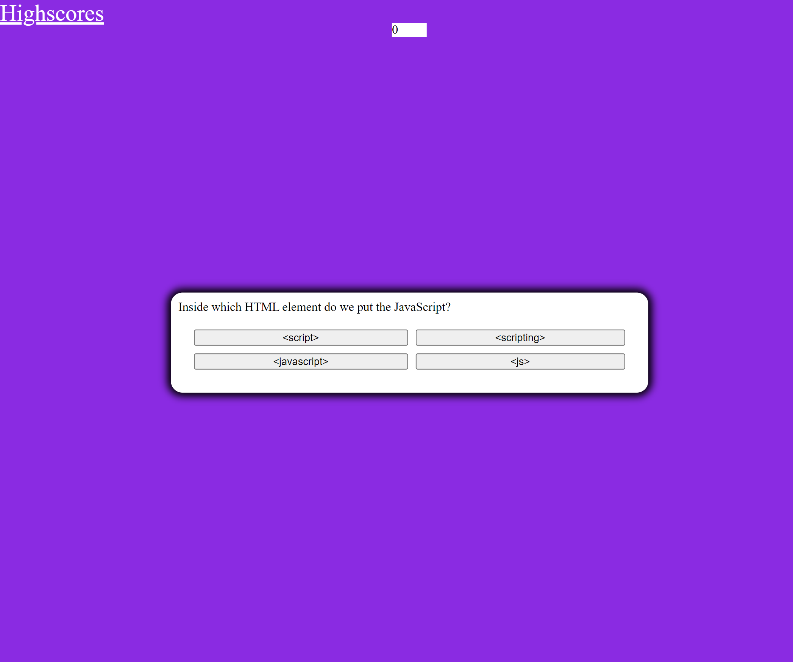

# unitFourCodeQuiz

[Here is a link to the deployed page](https://amber-robeck.github.io/unitFourCodeQuiz/ "Password generator")

## Code Quiz

#### In this quiz you will find an array of questions with a choice of four options to have a one in four chance of getting the answer correct. That is of course---UNLESS you know your Javascript then you my friend, will excel at this quiz and make your name to the top of the score board. This quiz is timed, currently set at 45 seconds with a deduction of 10 seconds if you choose a wrong answer. Each question is worth 5 points and at the end of the questions you will be prompted to enter in initials to save your score locally and be brought to the highscores page.

##### This project was created for school
